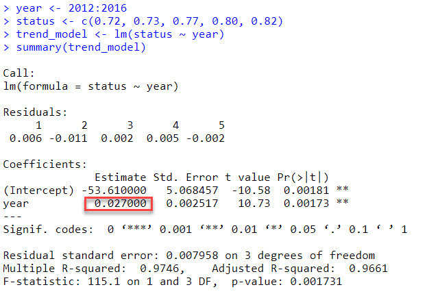

Work together to answer these questions.  

All the information you need should be in the OHI Methods [document](https://raw.githack.com/OHI-Science/ohi-global/published/documents/methods/Supplement.html#2_the_theory_of_ohi).

I will be around to answer any questions...so don't hesitate to get clarification, extra guidance, or request hints!

### OHI score models and data
1. What is the difference between a goal's "status" and "score"?

**Answer:** The "status" is the current state of the goal (the year of the assessment) and the "score" is the combination of the current "status" and the "future" status, which are averaged equally. "future" and "status" are categorical values within the `dimension` variable. The "future" predicted status is the current status modified by variables (resilience, pressures, and trend) expected to influence future status. The trend covers 5 years (the current year and 4 years in the past and predicting 5 years in the future by multiplying the linear regression slope by 5) and is twice as important as resilience and pressures when considering the calculation of the predicted "future" status.

2. If a region's food provision goal has the following values, what would its food provision score be?

Predicted future status: 80

Current status: 60

**Answer:** (80 + 60) / 2 = 70
The region's food provision score is 70. 

3. Given the following data, what would this region's Index score be?

Goal/subgoal  | Abbreviation   | Score
------------- | -------------- | -------------
Artisanal Fishing Opportunity | AO | 90
Habitat | HAB | 50
Species Condition | SPP | 30
Carbon Storage | CS | 20
Clean Waters | CW | 95
Coastal Livelihoods and Economies | LE | 60
Coastal Protection | CP | 80
Food Provision | FP | 85
Natural Products | NP | 100
Sense of Place | SP | 10
Tourism and Recreation | TR | 50


NOTE: The abbreviations for subgoals have 3 letters and goals have 2 letters.

**Answer:** The regional index score is calculated as the average of all goal scores for that region. Therefore, we sum up all the scores and divide by the number of rows. However, first we need to account for the fact that there are 2 subgoals present among all the overall goals, so those need to be used to calculate the overall goal before we take the average of the 10 overall goals. Because HAB and SPP are equally weighted to calculate the Biodiversity goal, we add 50 and 30 and divide by 2 to get 40. The next step is to then add all 10 overall scores up and divide by 10. The regions's index score is 63. 

(50 + 30) / 2 = 40

(90 + 40 + 20 + 95 + 60 + 80 + 85 + 100 + 10 + 50) / 10  = 63

4. Fill in the missing values.  

NOTE: Pressure and resilience must be multiplied by 0.01.  Trend and status are not modified. 

```{r}
# do separate calculations for scenario 1, designated by the suffix _1, and scenario 2, designated by the suffix _2
# first calculate the missing future status value, which is an unequally weighted calculation of trend, pressure, and resilience
# trend is twice as important as pressures and resilience, and the later 2 need to be multiplied by 0.01 and subtracted (resilience minus pressure)
trend_s1 <- 0.10
pressure_s1 <- 100
resilience_s1 <- 50
current_s1 <- 75
future_s1 <- (1 + (0.67*trend_s1) + (1 - 0.67)*(0.01*resilience_s1 - 0.01*pressure_s1))*current_s1

# calculating scores is the equally weighted future ans status
score_s1 <- (future_s1 + current_s1) / 2

# score scenario2
current_s2 <- 75
future_s2 <- 80
score_s2 <- (future_s2 + current_s2) / 2

# calculate the difference in scores between scenarios
diff_score <- score_s1 - score_s2
diff_score <- round(diff_score, 2)
```


Dimension | Scenario 1 | Scenario 2
---------- | ---------- | ---------
Score      | `r score_s1`           | `r score_s2`
Current status |  75 | 75
Predicted future status | `r future_s1` |  80
Trend | 0.10 | 0.10
Pressure | 100 | 50
Resilience | 50 | 50

QUESTION: How did a pressure change from 100 to 50 affect the final score?  Was this a larger or smaller effect than you would have expected?

**Answer:** A pressure change from 100 to 50 affected the final score by reducing it from `r score_s1` to `r score_s2`, which was a difference of `r diff_score`. This was a larger effect than I expected, based on the small proportion of the overall score that is composed of the pressure component.


### Humans as part of the ecosystem
<br>
5. To calculate the Fishery subgoal, we:

a. Obtain B/Bmsy  scores for each stock that is harvested.   B/Bmsy is defined as: the ratio of observed biomass to the biomass that would provide maximum sustainable yield. When B/BMSY = 1, then biomass equals BMSY. If B/BMSY falls below 1, biomass is too low to provide maximum sustainable yield. For example, if B/BMSY = 0.5, then biomass is only 50% of that needed for maximum sustainable yield. (from: http://www.catchshareindicators.org/wp-content/uploads/2013/12/NE_Biomass_Feb-2014.pdf)

b. Convert B/Bmsy into a stock status score that ranges from 0-1, with one reflecting a perfect score.  The relationship between B/Bmsy values and stock status scores looks like this:


c. Take some sort of average of the stock status scores within each region (for the global we use a geometric mean weighted by catch).

QUESTION: B/Bmsy scores greater than 1 indicate the stock is doing well, but is underharvested!  Given this, do you think we should penalize underharvesting? Why? Do you have any ideas for how we could account for underharvesting without unduly penalizing regions that are trying to let stocks recover? 

**Answer:** I think it would be possible and more accurate philosophically to penalize underharvesting, considering that human well-being is important to OHI calculations. I think a possible way to account for this would be to only apply the penalization to fish stocks that are in good standing, and not apply the penalization to countries that are letting stocks recover because their stocks are not in good standing. This could be done by adding a boolean variable (column) to a dataframe that represents each region as a row, and the regions are subset to those that only have a B/Bmsy value greater than 1. In this subset dataframe, a boolean value of 1 indicates that the region is not letting stocks recover because they are in good standing, and 0 representing that the country is letting stocks recover. Then filter for the countries that have a value of 1 and apply the penalization to each region. I can imagine that assigning the 0 or 1 indicator would be complex if a large fishing country like the US has some fisheries that are recovering and some that are in good standing. Therefore, perhaps a slightly different approach would be to apply a value that ranges 0-1 with 0 indicating that all fisheries stocks are recovering and 1 representing all fisheries are in good standing, and a value of 0.5, for example, would mean that half of the fisheries stocks are recovering, so the penalization would be weighted by this value. It would be interesting to consider how many countries are in this situation, and what proportion of countries have many fisheries within a singular country have different statuses for fish stocks.

### Gapfilling
6. Imagine you are calculating OHI scores for 10 regions.  The data you can find for an economic variable that is used to calculate the status of one of the goals looks like this:

rgn_id   | data
-------- | -------
1        | 72
2        | 74
3        | 80
4        | 70
5        | NA
6        | NA
7        | 71
8        | 75
9        | 76
10       | 76

QUESTION: Should the missing values (NA is a missing value in R) remain missing?  If so, why?

Or, should you try to estimate the missing values?  If so, how might you go about estimating them?

**Answer:** The missing values should not remain missing because we need the index scores to be comparable, so we would not be able to include regions 5 and 6 in the analysis, but we also do not want to drop those regions if there is a reasonable way to interpret them because they will be included for other goals for which they do have data. Therefore, depending on what the goal is, we could interpolate using other regions that are similar economically and scale-wise (like comparing a country of similar population size as well as similar economy). Alternatively, we could fill these NA values with 0 if we are fairly certain that the reason we lack data is because regions 5 and 6 do not have that economic process present, but there is potential for that economic process to be executed. For example, if the economic goal we are dealing with is natural products, and regions 5 and 6 do have natural resources they could potentially sustainably harvest but do not, resulting in a lack of data, then they should get a score of 0 because they are not harvesting at all. 


### Goal status and trend
<br>

7. Read the methods section for the Lasting Special Places subgoal: https://ohi-science.org/ohiprep_v2021/Reference/methods_and_results/Supplement.html#692_Lasting_special_places_(subgoal_of_sense_of_place)

The information in this section describes how status and trend are calculated for this goal, it also includes the data used to calculate the pressure and resilience dimensions.

QUESTION: What is the reference point for this subgoal?

**Answer:** The reference point for this subgoal is 30% of total area being protected. This includes the assumption that each country should protect the same amount of coastline proportional to the amount that they have. I do have reservations about philosophically accepting that assumption, but I can see how trying to account for country-level variation in coastal resources can get too complicated without such broad assumptions.

Explore the links to the pressures and resilience data layers.

Follow this link to the functions.R file in ohi-global: https://github.com/OHI-Science/ohi-global/blob/draft/eez/conf/functions.R

Find the Lasting Special Places function.  See if you can reconcile the model described in the Methods with the code. (NOTE: Just aim for a large picture overview...at this point you do not need to understand every step….or even most of this)

**Answer:** Looking at the model, I see that the `inland` and `offshore` areas are combined by `region_id` and `year`. The `AlignDataYears()` function is used to link the year data was collected to the appropriate scenario year for a data layer. This is important because data used in a scenario year was not necessarily collected that year, and the amount of lag years differs for goals. I also see that the NA values are replaced by 0. As Cullen, Peter, and I discussed this function, we considered that it would be interesting to try this function as-is on some data, then change the trend to be 4 or MORE years in the past using the same data (perhaps without converting NA values to 0, but rather ignoring NA values), and determine if the output is significantly different.

8. The trend for the Tourism and Recreation goal for the United States is -0.15.  Describe what this means.

Since the trend is negative, this means that US's score for Tourism and Recreation is decreasing over the time period of the 5 most recent years (the scenario year and 4 years prior). To calculate the proportional change of -0.15, we divide the slope estimate by the status value of the earliest year of data used in the trend calculation. The earliest year is used as the baseline. The units are proportional change, ranging from -1 to 1. 


9. We are going to walk through a trend calculation.  If R is installed on your computer, follow along.

Status data for a region's Tourism and Recreation goal:

Year  | Status
------ | ----------
2010  | 72
2011  | 71
2012  | 72
2013  | 73
2014  | 77
2015  | 80
2016  | 82

*STEP 1* Estimate the average change per year using a linear regression model




The 0.027 value is the slope estimate, which is the average change in status per year estimated by the linear model.


*STEP 2* Obtain proportional change by dividing the slope estimate by the earliest status value used in the linear model:

`0.027/0.72 = 0.0375`

There has been nearly a 4% increase in status per year.

*STEP 3* The goal is to predict the change in 5 years, so we multiply the yearly proportional change by 5:

`0.0375 * 5 = 0.1875`

Status is predicted to increase about 19% in 5 years.

In 2021, status is predicted to be (ignoring pressure/resilience dimensions):
82 * (1 + 0.1875) = 97

QUESTION: What assumptions are we making by using this formulation of trend to calculate the likely future status?

**Answer:** We are assuming that the scenario year and the 4 prior years are the most indicative of the trend moving forward, meaning that this subset of the years is more accurate than using all prior years available. We also assume a linear trend with no time lag or limit (like carrying capacity). Furthermore, due to omitting any political information or biological information, we are assuming that policies and biological stochasticity or stability in this region are to remain similar for the next 5 years. By ignoring the pressure/resilience dimensions, we assume that they cancel each other out for the years considered. 

QUESTION: Can you think of any scenarios when we would not use 5 years of data to estimate trend?

**Answer:** I can imagine we would not use 5 years of data to estimate trend if we do not have data for at least 1 year in the past 5 years, (but the years used to replace missing years cannot exceed 10 years in the past). Also, we do not use 5 years of data if we are calculating certain habitat trends within the Biodiversity goal (coral reefs, seagrasses/kelp, and saltmarshes). The methodology states that "Coral reef habitat trends were calculated on a per country basis, using all available data. For saltmarsh we apply a single global trend value for each region. For seagrasses and kelp we calculated trends on a per site basis." That means coral reefs are not restricted to 5 years of data, and it is not clear if saltmarshes and seagrasses and kelp trends are using all available data or just the last 5 years. On the other hand, 5 years is the limit for mangroves, sea ice, and soft bottom habitat. Additionally, many trends are calculated using 5 years, but each year is actually a rolling/moving average, so the prior years are systematically embedded in these values. 

### Goal pressure and resilience
<br>

10. The pressure dimension plays a relatively small role in goal scores (see figure 4.1), but it takes a lot of effort to prepare the data!

The final pressure dimension is calculated for each region and goal using a function from the ohicore package.  The function requires several pieces of information:

a. A data layer for each pressure layer describing the magnitude of the pressure on a scale of 0-1.  For example, here is the sea surface temperature pressure layer (low pressures are good and high pressures are bad): https://github.com/OHI-Science/ohiprep_v2022/blob/gh-pages/globalprep/prs_sst/v2021/output/sst_updated.csv

b. Classifying the pressure category for each data layer. The pressure dimension is based on two types of pressures: Ecological and Social (Figure 4.2).  The ecological pressures are broken into 5 categories (pollution, alien species, habitat destruction, fishing, and climate change).  Each pressure data layer is assigned to a category in this file: https://github.com/OHI-Science/ohi-global/blob/draft/eez/conf/pressure_categories.csv

QUESTION: How many climate change pressures are there?

**Answer:** There are 4 climate change pressures: cc_sst, cc_acid, cc_uv, cc_slr.

c. Pressure x goal weighting. Pressures have little or no effect on some goals, but huge effects on others.  The relationship between the goals and the pressure variables is described here: https://github.com/OHI-Science/ohi-global/blob/draft/eez/conf/pressures_matrix.csv

QUESTION: Which pressure layers affect the FIS subgoal?  How many regulatory pressure layers are there?  How many social layers are there?  Which is more important: Ecological or Social pressures? 

```{r}
library(tidyverse)

pressure <- read.csv("https://github.com/OHI-Science/ohi-global/blob/draft/eez/conf/pressure_categories.csv")

```

**Answer:** The pressure layers affecting the FIS subgoal are:
1. fp_art_hb
2. fp_art_lb
3. fp_com_hb
4. fp_com_lb
5. hd_intertidal
6. hd_subtidal_hb
7. hd_subtidal_sb
8. po_chemicals
9. po_nutrients
10. sp_alien
11. sp_genetic
12. ss_spi
13. ss_wgi

QUESTION: Some goals, like Coastal Protection, have multiple “elements”.  Why? 

NOTE: It is convention to add a superscript to the pressure name that describes its category:
* po=pollution
* hd=habitat destruction
* sp=alien species
* fp=fishing pressure
* cc=climate change

<br>
<br>

11.  Similar to the pressures dimension, resilience plays a relatively small role in goal scores (see figure 4.1) but still takes a lot of effort.

The final pressure dimension is calculated for each region and goal using a function from the ohicore package.  The function requires several pieces of information:

a. A data layer for each pressure layer describing the magnitude of the pressure on a scale of 0-1. For example, here is the Social Progress Index layer (low resilience is bad and high resilience is good): https://github.com/OHI-Science/ohiprep_v2022/blob/gh-pages/globalprep/prs_res_spi/v2021/output/spi_res.csv

b. The resilience dimension includes two major categories: Ecological and Social (Figure 4.3). Ecological resilience has two subcategories: Ecosystem and Regulatory.  Regulatory is comprised of the same 5 subcomponents as the Ecological *pressures*: pollution, alien species, habitat destruction, fishing, and climate change.  There is also a “goal” specific subcomponent.   Each resilience data layer is assigned to a category in this file: https://github.com/OHI-Science/ohi-global/blob/draft/eez/conf/resilience_categories.csv

c. The relationship between goals and resilience is described here: https://github.com/OHI-Science/ohi-global/blob/draft/eez/conf/resilience_matrix.csv
<br>
<br>

### Data layers
<br>

12. Explore table 7.0.1 in the methods. 

<br>
<br>

